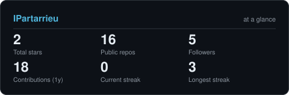
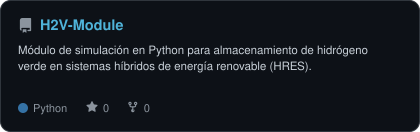
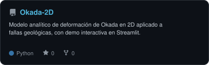
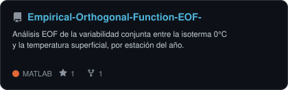
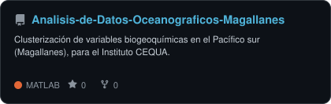

<!-- Banner animado: retrato propio (fondo eliminado) en un patrón de puntos que
     transiciona por las tres grandes áreas de la geofísica — sol y nube con
     lluvia (atmósfera), ola (océano) y volcán en erupción (tierra sólida) —
     antes de volver al retrato.
     Generado por scripts/banner/generate.py a partir de assets/source/ignacio.png;
     los íconos se dibujan con formas simples en scripts/banner/generate.py, sin
     imágenes externas. -->
<picture>
  <source media="(prefers-color-scheme: dark)"  srcset="assets/banner-dark.svg">
  <source media="(prefers-color-scheme: light)" srcset="assets/banner-light.svg">
  
</picture>

 

 

&nbsp;&nbsp;
&nbsp;&nbsp;
&nbsp;&nbsp;

---

## Sobre mí

Geofísico y Magíster en Geofísica (mención en Modelación Geofísica, Universidad de Concepción). Trabajo de forma independiente junto a [MetGeo](https://www.linkedin.com/company/metgeo-spa/), desarrollando soluciones de modelación y análisis geofísico, con foco en resiliencia climática y sistemas de energía renovable.

- 📄 **Primer autor** del artículo *"Energy Transition from Chilean Patagonia: Optimal Sizing of a Hybrid Renewable Energy System"*, *Journal of Energy Storage* (2026) — [DOI](https://doi.org/10.2139/ssrn.5776384).
- 🎓 Docente en Universidad de Concepción (Meteorología Dinámica y Sinóptica) y Universidad Católica de Temuco (Física de la Atmósfera y el Océano).
- 🔋 Desarrollo de módulos de simulación de almacenamiento de hidrógeno verde para sistemas híbridos de energía renovable (HRES) — ver [`H2V-Module`](https://github.com/IPartarrieu/H2V-Module).
- 🌊 Análisis de datos oceanográficos y atmosféricos para proyectos de investigación (Instituto CEQUA, MERIC by ENERGIAMARINA).

 

## Stack técnico

**Áreas:** modelación geofísica, problemas inversos, procesamiento de señales, climatología y meteorología, energías renovables no convencionales
 
**Herramientas adicionales:** WRF, ArcGIS/QGIS, SQL

---

## Radar de habilidades

<table>
<tr>
<td width="50%" align="center" valign="middle">

<!-- Autoevaluación de habilidades técnicas - editar assets/skills.json, el workflow la redibuja -->
<picture>
  <source media="(prefers-color-scheme: dark)"  srcset="assets/radar-dark.svg">
  <source media="(prefers-color-scheme: light)" srcset="assets/radar-light.svg">
  
</picture>

</td>
<td width="50%" align="center" valign="middle">

<!-- Radar de áreas de aplicación, editar assets/domains.json -->
<picture>
  <source media="(prefers-color-scheme: dark)"  srcset="assets/radar-domains-dark.svg">
  <source media="(prefers-color-scheme: light)" srcset="assets/radar-domains-light.svg">
  
</picture>

</td>
</tr>
</table>

---

## En números

<!-- Tarjeta de estadísticas autogenerada por scripts/cards.py. No usa
     github-readme-stats / github-profile-trophy: esos servicios públicos
     compartidos a veces caen o agotan su cuota. -->
<picture>
  <source media="(prefers-color-scheme: dark)"  srcset="assets/card-stats-dark.svg">
  <source media="(prefers-color-scheme: light)" srcset="assets/card-stats-light.svg">
  
</picture>

 

<!-- Generado por el workflow Metrics (.github/workflows/metrics.yml) -->

  

## Proyectos destacados

<table>
<tr>
<td>

<picture>
  <source media="(prefers-color-scheme: dark)"  srcset="assets/card-H2V-Module-dark.svg">
  <source media="(prefers-color-scheme: light)" srcset="assets/card-H2V-Module-light.svg">
  
</picture>

</td>
<td>

<picture>
  <source media="(prefers-color-scheme: dark)"  srcset="assets/card-Okada-2D-dark.svg">
  <source media="(prefers-color-scheme: light)" srcset="assets/card-Okada-2D-light.svg">
  
</picture>

</td>
</tr>
<tr>
<td>

<picture>
  <source media="(prefers-color-scheme: dark)"  srcset="assets/card-Empirical-Orthogonal-Function-EOF--dark.svg">
  <source media="(prefers-color-scheme: light)" srcset="assets/card-Empirical-Orthogonal-Function-EOF--light.svg">
  
</picture>

</td>
<td>

<picture>
  <source media="(prefers-color-scheme: dark)"  srcset="assets/card-Analisis-de-Datos-Oceanograficos-Magallanes-dark.svg">
  <source media="(prefers-color-scheme: light)" srcset="assets/card-Analisis-de-Datos-Oceanograficos-Magallanes-light.svg">
  
</picture>

</td>
</tr>
</table>

---

## Contacto

- Correo: [ipartarrieua@gmail.com](mailto:ipartarrieua@gmail.com)
- LinkedIn: [ignacio-partarrieu-andrade](https://www.linkedin.com/in/ignacio-partarrieu-andrade/)
- MetGeo: [LinkedIn](https://www.linkedin.com/company/metgeo-spa/)

Los radares y las tarjetas de este README se generan con los scripts en <code>scripts/</code> y se actualizan solos vía GitHub Actions cuando cambian los archivos en <code>assets/*.json</code>.
 
El sistema de radares, tarjetas y banner animado está basado en el de <a href="https://github.com/emmi-lili/emmi-lili">emmi-lili/emmi-lili</a>.

